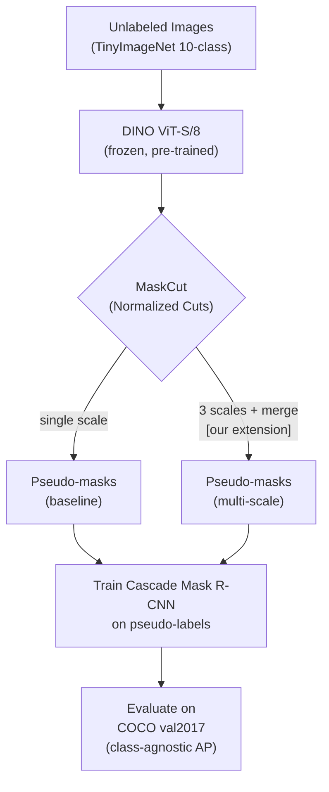

# Pipeline Overview — Figure Description

This file describes the pipeline flowchart to draw for the report and slides (slide 5).
Suggested tools: Excalidraw, draw.io, or Mermaid (see Mermaid draft below).

## Conceptual flow

```
ImageNet / TinyImageNet
        │
        ▼
  ┌─────────────┐
  │  DINO ViT   │  Pre-trained self-supervised backbone (no labels)
  │  (frozen)   │  Output: self-attention maps, key features
  └──────┬──────┘
         │
         ▼
  ┌─────────────────────────┐
  │  MaskCut (Normalized    │  Iterative graph partitioning on attention map.
  │  Cuts on attention)     │  Produces N binary pseudo-masks per image.
  │                         │
  │  [OURS: run at 3 scales │  Multi-scale variant: also crops the image at
  │   + merge proposals]    │  0.75× and 0.5×, runs MaskCut on each crop,
  └──────────┬──────────────┘  back-projects masks, merges via IoU-NMS.
             │
             ▼ pseudo-labels JSON (COCO format)
  ┌─────────────────────────┐
  │  Cascade Mask R-CNN     │  Standard Detectron2 detector, trained
  │  (R50 + FPN)            │  entirely on pseudo-labels — no GT boxes.
  └──────────┬──────────────┘
             │
             ▼
  ┌─────────────────────────┐
  │  COCO val2017 eval      │  Class-agnostic AP / APs / APm / APl.
  │  (class-agnostic)       │
  └─────────────────────────┘
```

## Mermaid draft (copy into a .md or Mermaid Live Editor)



## Key points to annotate on the figure

1. **No labels anywhere** — highlight that the entire pipeline is unsupervised.
2. **DINO is frozen** — we never fine-tune the backbone.
3. **The only difference** between baseline and ours is the MaskCut stage.
4. **Same detector training** — controlled comparison, params locked.

## Figure caption draft

> **Figure 1.** CutLER pipeline with our multi-scale MaskCut extension. DINO self-attention
> maps drive iterative normalized cuts to produce pseudo-masks. Our extension runs MaskCut
> at multiple crop scales and merges proposals before training the detector, with no other
> changes to the pipeline.
